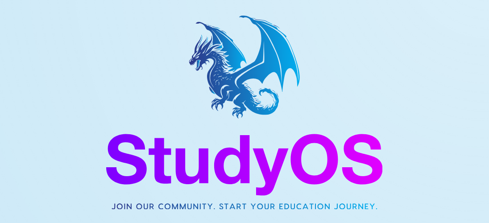

# StudyOS



StudyOS was developed as part of a project at the Stuttgart Media University and is an AI-supported gamification learning platform.<br>
This is merely a demo with only partially functional content.

## Getting Started

1. Clone the repository on your device

```
git clone https://github.com/PatrykGadziomski/StudyOS.git
```

2. Redirect to the repository on your device

```bash
cd learning_app_lul
```

2. Cretae python enviroment inside the project

```
python -m venv venv
```
INFO: There are some dependecies you have to install manually:
```bash
pip install markitdown
pip install openai
```

3. Activate python envoriment
```bash
.\.venv\scripts.\activate
```

4. Don't forget to add your API Key to the following scripts:
```bash
1. ./python_scripts/main.py
2. ./app/api/chat/route.ts
3. ./app/api/chatnpc/route.ts
```

4. Put your university script in the ``./python_scripts/data`` folder and run the prestart to generate all data from existig university script. For now, it works the best with only one chapter of the university script.
The demo already have a dummy university script in the ``./python_scripts/data``, so for testing only you don't have to upload any files.
```
npm run prestart
```
PS: You also have to delete all of the generated files (e.g. all files in ``./app/data``), if you want to experiment with the outputs (Forgot to implement a replacement function... -.-)

5. Run build
```
npm run build
```

6. Run start and enjoy
```
npm run start
```

Open [http://localhost:3000](http://localhost:3000) with your browser to see the result.

Want to develop something?
Run the development server:
```bash
npm run dev
# or
yarn dev
# or
pnpm dev
# or
bun dev
```
